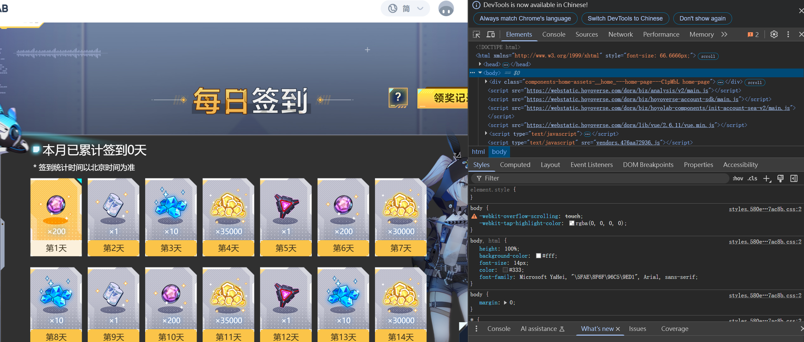
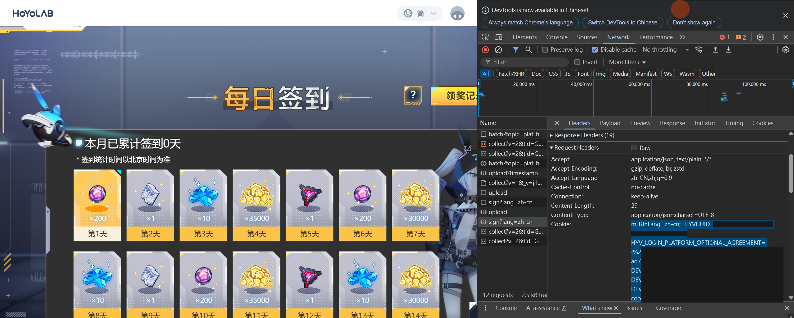

# How to Obtain Mihoyo Game Cookies

⚠️ **Critical Security Notice**  
🔐 Cookies are equivalent to your account password!  
🚫 Never share cookies with anyone  
⏳ Cookies expire when you:  

   - Log out manually  
   - Change password  
   - Experience prolonged inactivity

## Safe Cookie Retrieval Method

### Recommended Browser Setup
```diff
+ Use Incognito/Private Browsing Mode
+ Close all other tabs before starting
- Avoid regular browser mode
- Never logout after obtaining cookies
```


## 📋 Prerequisites

- Chrome/Firefox/Edge browser
- Logged-in HoYoLAB account


## 🛠 Step-by-Step Guide

### 1. Access Daily Check-in Page
1. Visit HoYoLAB Daily Check-in
2. Select your game
3. **Stop before signing in!!!** - we need to capture the request

### 2. Open Browser Developer Tools
| Browser     | Method                         |
| ----------- | ------------------------------ |
| Chrome/Edge | `F12` or `Ctrl+Shift+I`        |
| Firefox     | `Ctrl+Shift+C`                 |
| Safari      | `Develop > Show Web Inspector` |



### 3. Monitor Network Requests
1. Switch to **Network** tab
2. Check "Preserve log"


### 4. Perform Check-in Action
1. **Click the check-in button**
2. In Network tab, look for requests containing:
   ```text
   /sign?lang=

### 5. Extract Cookies
1. Click the identified request
2. Go to **Headers** section
3. Copy all text under **Request Headers > Cookie**




## 🛠 Post-Retrieval Steps

1. Paste cookies to configuration file:

   ```typescript
   // /api/config.ts
   {
     plugins: [
       {
         name: 'genshin',
         modulePath: "@official/genshin.js",
         options: {
           users: [{
             cookies: 'PASTE_COOKIES_HERE' // ← Paste here
           }]
         }
       }
     ]
   }
   ```

2. Universal Cookie Notice:

   ```diff
   + Single cookie works for all Mihoyo games
   + Same cookies valid for:
     - Genshin Impact
     - Honkai: Star Rail
     - Zenless Zone Zero
     - etc.
   - No need to recollect per game
   ```