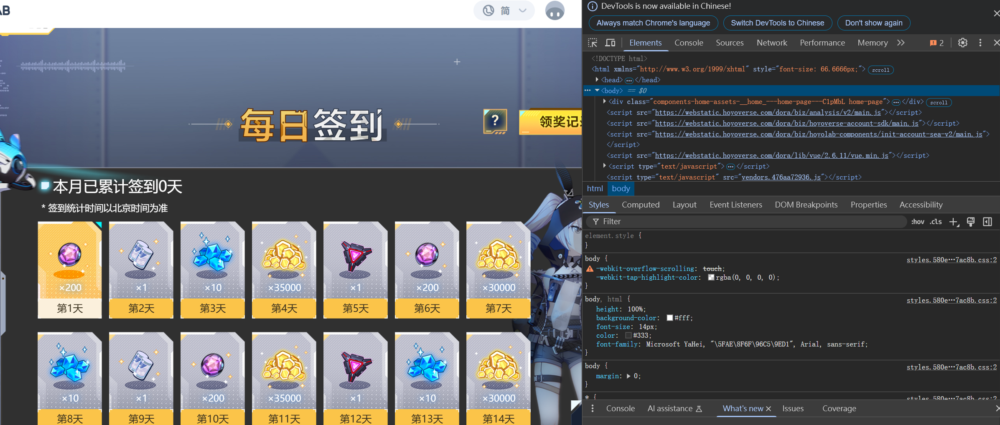
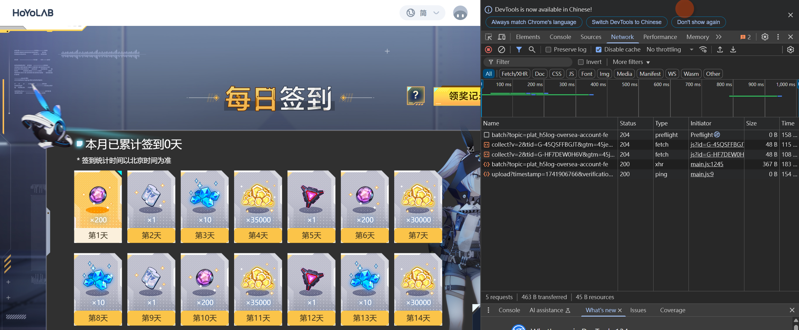
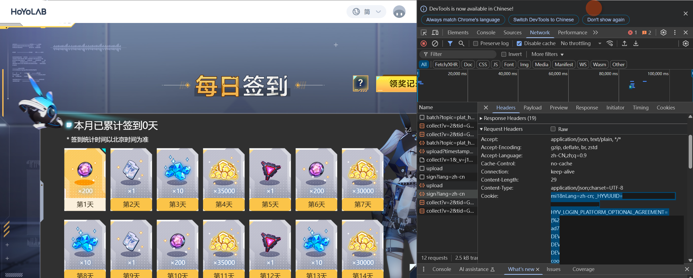

# **ミホヨゲームのクッキーの取得方法**

⚠️ **重要なセキュリティ注意事項**
 🔐 **クッキーはアカウントのパスワードと同等の情報です！**
 🚫 **クッキーを他人と共有しないでください**
 ⏳ **以下の条件でクッキーは無効になります**

- 手動でログアウトした場合
- パスワードを変更した場合
- 長時間アクティビティがなかった場合

------

## **安全なクッキー取得方法**

### **推奨ブラウザ設定**

```diff
+ シークレットモード/プライベートブラウジングを使用
+ 開始前に他のタブをすべて閉じる
- 通常のブラウザモードは避ける
- クッキー取得後にログアウトしない
```

------

## 📋 **事前準備**

- Chrome / Firefox / Edge ブラウザ
- HoYoLAB アカウントにログイン済みであること

------

## 🛠 **手順**

### **1. デイリーチェックインページにアクセス**

1. HoYoLAB の **デイリーチェックインページ** に移動
2. 自分のゲームを選択
3. **まだチェックインしない！**（クッキーを取得するためにリクエストを記録する必要があります）

------

### **2. ブラウザの開発者ツールを開く**

| **ブラウザ**  | **開発者ツールを開く方法**     |
| ------------- | ------------------------------ |
| Chrome / Edge | `F12` または `Ctrl+Shift+I`    |
| Firefox       | `Ctrl+Shift+C`                 |
| Safari        | `開発 > Webインスペクタを表示` |



------

### **3. ネットワークリクエストを監視**

1. **「ネットワーク」タブ** に切り替え
2. **「ログを保持（Preserve log）」にチェックを入れる**



------

### **4. チェックイン操作を実行**

1. **チェックインボタンをクリック**

2. 「ネットワーク」タブで、以下のようなリクエストを探す

   ```text
   /sign?lang=
   ```

------

### **5. クッキーを取得**

1. 対象のリクエストをクリック
2. **「Headers（ヘッダー）」タブ** を開く
3. **「Request Headers > Cookie」内のすべてのテキストをコピー**



------

## 🛠 **取得後の手順**

1. クッキーを設定ファイルに貼り付ける

   ```typescript
   // /api/config.ts
   {
     plugins: [
       {
         name: 'genshin',
         modulePath: "@official/genshin.js",
         options: {
           users: [{
             cookies: 'ここにクッキーを貼り付ける' // ← ここにペースト
           }]
         }
       }
     ]
   }
   ```

------

1. **汎用クッキーの注意点**

```diff
+ 1つのクッキーでミホヨの全ゲームに対応
+ 同じクッキーで利用可能：
  - 原神（Genshin Impact）
  - 崩壊：スターレイル（Honkai: Star Rail）
  - ゼンレスゾーンゼロ（Zenless Zone Zero）
  - その他
- ゲームごとにクッキーを取得し直す必要なし
```