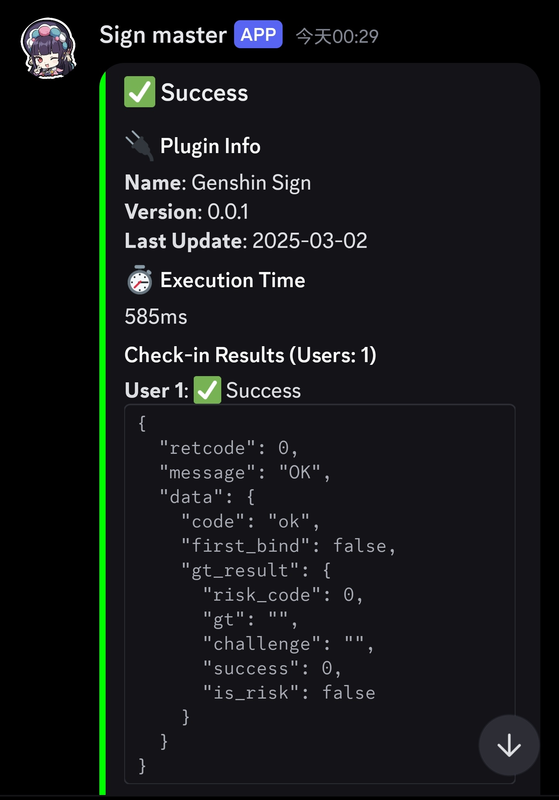

# Plugin & Middleware Documentation 

## Available Plugins

<details>
    <summary>🔧 <a href="https://github.com/mastersamasama/Mihoyo-AutoSign-Hub/blob/main/api/plugins/genshin.js">Genshin Sign</a> | Author: mastersamasama | Updated: 2025-03-20</summary>

**Automated daily check-ins for [Genshin Impact](https://genshin.hoyoverse.com/)**

 

```javascript
{
    name: 'genshin',
    modulePath: "@official/genshin.js",
    options: {
        users: [{cookies: 'YOUR_COOKIES_HERE'}],
        lang: 'zh-tw'
    }
}
```

⚠️ **Security Alert**  
Never share your cookies with anyone!

### Resources
- [How to Get Cookies Guide](https://github.com/mastersamasama/mihoyo-checkin/blob/master/doc/how_to_get_cookies.md)
- Supported Regions: Global
</details>

<details>
    <summary>🚄 <a href="https://github.com/mastersamasama/Mihoyo-AutoSign-Hub/blob/main/api/plugins/starrail.js">Star Rail Sign</a> | Author: mastersamasama | Updated: 2025-03-20</summary>

**Automated check-ins for [Honkai: Star Rail](https://hsr.hoyoverse.com/)**

 

```javascript
{
    name: 'starrail',
    modulePath: "@official/starrail.js",
    options: {
        users: [{cookies: 'YOUR_COOKIES_HERE'}],
        lang: 'zh-cn'
    }
}
```

⚠️ **Security Alert**  
Cookie confidentiality is crucial!

### Resources
- [How to Get Cookies Guide](/how_to_get_cookies_en-us.md)
- Supported Regions: Global
</details>

## Middleware Solutions

<details>
    <summary>🔔 <a href="https://github.com/mastersamasama/Mihoyo-AutoSign-Hub/blob/main/api/middlewares/discord-notify.js">Discord Notify</a> | postCheckin/onError hooks | Author: mastersamasama | Updated: 2025-03-13</summary>


**Real-time notifications via Discord webhooks**

 

```javascript
{
    name: "discord-notify",
    modulePath: "@official/discord-notify.js",
    target: ["*"],
    options: {
        webhook: "YOUR_WEBHOOK_URL",
        language: "en",
        tag_filter: [0],
        mentionUsers: ["USER_ID"]
    }
}
```



🔒 **Security Note**  
Store webhook URLs in environment variables

### Configuration Options
| Option       | Description           | Default  |
| ------------ | --------------------- | -------- |
| webhook      | Discord webhook URL   | Required |
| language     | Notification language, support 'en', 'zh-cn', 'zh-tw', 'ja', 'ko' | "en"     |
| tag_filter   | Muted status codes    | [0]      |
| mentionUsers | User IDs to ping      | []       |

### Status Codes
- ✅ Success: `0`
- ⚠️ Already Checked In: `-5003`
- ❌ Cookie Expired: `-100`

### Resources
- [Discord Webhook Guide](https://support.discord.com/hc/en-us/articles/228383668-Intro-to-Webhooks)
- [Finding User IDs Guide](https://support.discord.com/hc/en-us/articles/4407571667351-How-to-Find-User-IDs-for-Law-Enforcement)
</details>

<details>
    <summary>🍪 <a href="https://github.com/mastersamasama/Mihoyo-AutoSign-Hub/blob/main/api/middlewares/cookies-tidy.js">Cookies Tidy</a> | preCheckin hook | Author: mastersamasama | Updated: 2025-03-13</summary>


**Automatic cookie sanitization for browser-copied strings**

 

```javascript
{
    name: "cookies-tidy",
    modulePath: "@official/cookies-tidy.js",
    target: ["*"]
}
```

ℹ️ **Automatic Processing**  
Works with raw cookie strings without configuration

### Transformation Example
```diff
• Input:  "ltoken=abc123; ltuid=123456; "
• Output: "ltoken=abc123;ltuid=123456"
```

### Handled Issues
- Extra whitespace removal
- Trailing semicolon cleanup
- Browser-specific formatting normalization
</details>