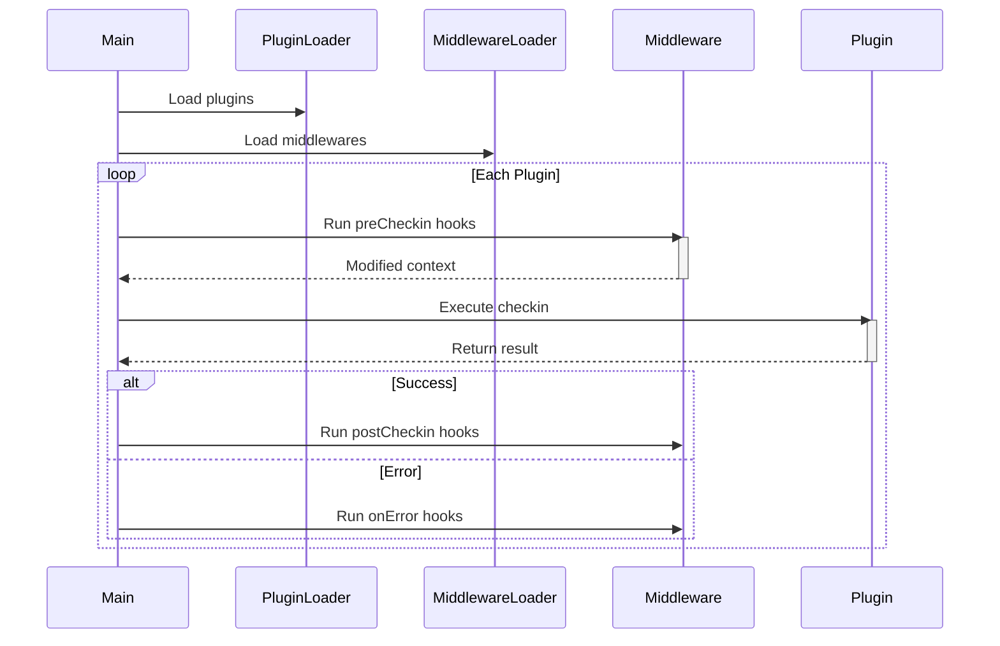
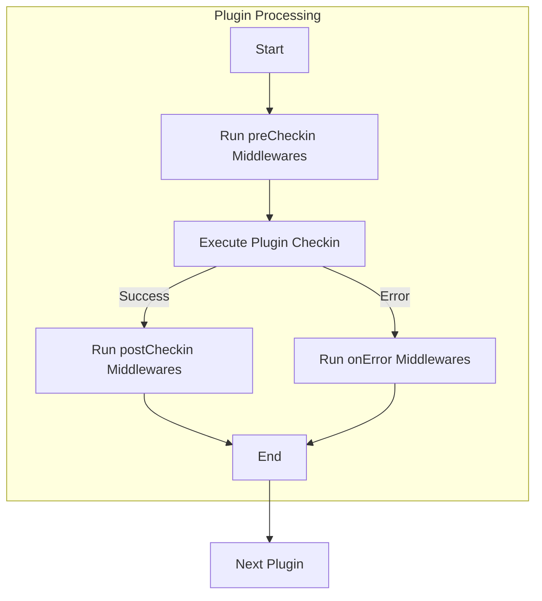

# Plugin & Middleware Development Guide

### System Execution Flow



### Execution Cycle




## Core Components Development

### Plugin Implementation

#### Template Structure

```typescript
export const meta = {
  name: "name",
  version: "0.1",
  author: "developer-name",
  date: "2025-01-01",
  contact: "developer-contact",
  description: "Plugin functionality summary",
  support: "Global/CN"
};

export const checkin = async (config) => {
  // Your checkin logic here
};
```


#### Example

Plugin Configuration

```typescript
plugins: [
  {
    name: "plugin example",
    modulePath: "./plugin.js",
    options: {
      users: [
        {
          cookies: "This is my cookies",
        },
      ],
      lang: "en-us",
    },
  },
],
```


Plugin Implementation

```typescript
// ./plugin.js
export const checkin = async (config) => {
	console.log(config)
    return config.users[0].cookies;
};
```


Example Output:

```json
{
  "users": [{"cookies": "This is my cookies"}],
  "lang": "en-us"
}
```

---

### Middleware Implementation

#### Template Structure

```javascript
function preCheckin(options, ctx) {
  // Pre-checkin operations
}

function postCheckin(options, ctx) {
  // Post-checkin operations
}

function onError(options, ctx) {
  // Error handling
}

export default {
  preCheckin,
  postCheckin,
  onError
}
```

#### Context Objects

```typescript
// Base context structure
export interface context {
    plugins_meta: { [name: string]: Record<string, string> }, // meta data of plugins
    timestamp: number; // timeStamps of checkin process started
}

// Extended context
export interface preContext extends context {
    plugin_options: any; // options of plugins
}

export interface postContext extends context {
    result: any; // result of checkin
}

export interface errorContext extends context {
    error: any; // error of checkin
}
```

#### Example

Configuration

```typescript
plugins: [
  {
    name: "plugin example",
    modulePath: "./plugin.js",
    options: {
      users: [
        {
          cookies: "This is my cookies",
        },
      ],
      lang: "en-us",
    },
  },
],
middlewares: [
  {
    name: "middleware example",
    modulePath: "@official/middleware.js",
    target: ["plugin example"],
    options: {
      webhook: "http://www.example.com/webhook",
    },
  },
];
```


Middleware Implementation

```typescript
// @official/middleware.js
function preCheckin(options, ctx) {
    console.log('options', options);
    console.log('pre ctx', ctx, '\n');
    ctx.plugin_options.users[0].cookies = "Cookie modified by preCheckin"
}

function postCheckin(options, ctx) {
    console.log('\noptions', options);
    console,log('post ctx', ctx);
}

export default {
    preCheckin,
    postCheckin,
}
```


Example Output:

```bash
options { webhook: 'http://www.example.com/webhook' }
pre ctx {
  plugins_meta: {
  name: "name",
  version: "0.1",
  author: "developer-name",
  date: "2025-01-01",
  contact: "developer-contact",
  description: "Plugin functionality summary",
  support: "Global/CN"
},
  timestamp: 1717027200000,
  plugin_options: {
    users: [ { cookies: 'This is my cookies' } ],
    lang: 'en-us'
  }
}

{
  users: [
    { cookies: 'Cookie modified by preCheckin' }
  ],
  lang: 'en-us'
}

options { webhook: 'http://www.example.com/webhook' }
post ctx {
  plugins_meta: {
  name: "name",
  version: "0.1",
  author: "developer-name",
  date: "2025-01-01",
  contact: "developer-contact",
  description: "Plugin functionality summary",
  support: "Global/CN"
},
  timestamp: 1717027200000,
  result: 'Cookie modified by preCheckin'
}
```

Please take a look on [Middleware Demo](https://github.com/mastersamasama/Mihoyo-AutoSign-Hub/blob/main/api/middlewares/discord-notify.js)


## Contribute Your Plugin

### Publish to Official Plugin List

Follow these steps to add your developed plugin to the [Official Plugin List](plugin_list.md):

1. **Ensure Compliance with Development Standards**  
   Verify that your plugin meets all code quality and security requirements.

2. **Documentation Preparation**  
   - Create documentation for your plugin.
   - Include usage examples and configuration instructions.

3. **Submit a Pull Request**  
   - Update documentation files:  
     - **/doc/plugin_list.md** (Add your plugin entry)
     - **/doc/plugin/yourplugin.md** (Create new documentation file if you want)
   - Include test reports (optional but recommended)
   - Add demo screenshots (optional)

---

## Plugin Submission Requirements

| Criteria              | Standard                  | Example                  |
| --------------------- | ------------------------- | ------------------------ |
| Code Quality          | Pass ESLint validation    | `eslint-config-standard` |
| Test Coverage         | ≥80%                      | Jest test report         |
| Dependency Management | No high-risk dependencies | Pass npm audit           |

---

## Development Standards

### Metadata Specification

```typescript
export const meta = {
  name: "plugin-name",          // lowercase-with-hyphens
  version: "1.0.0",             // Semantic Versioning
  author: "github-username",    // e.g.: mastersamasama
  date: "2023-03-15",           // Last update date (YYYY-MM-DD)
  contact: "contact@domain",    // Contact information
  description: "Plugin functionality description",
  support: "CN;Global"          // Supported regions
};
```

Please submit a request via GitHub Issue
