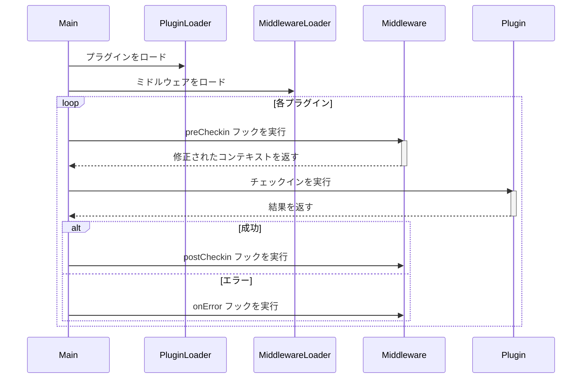
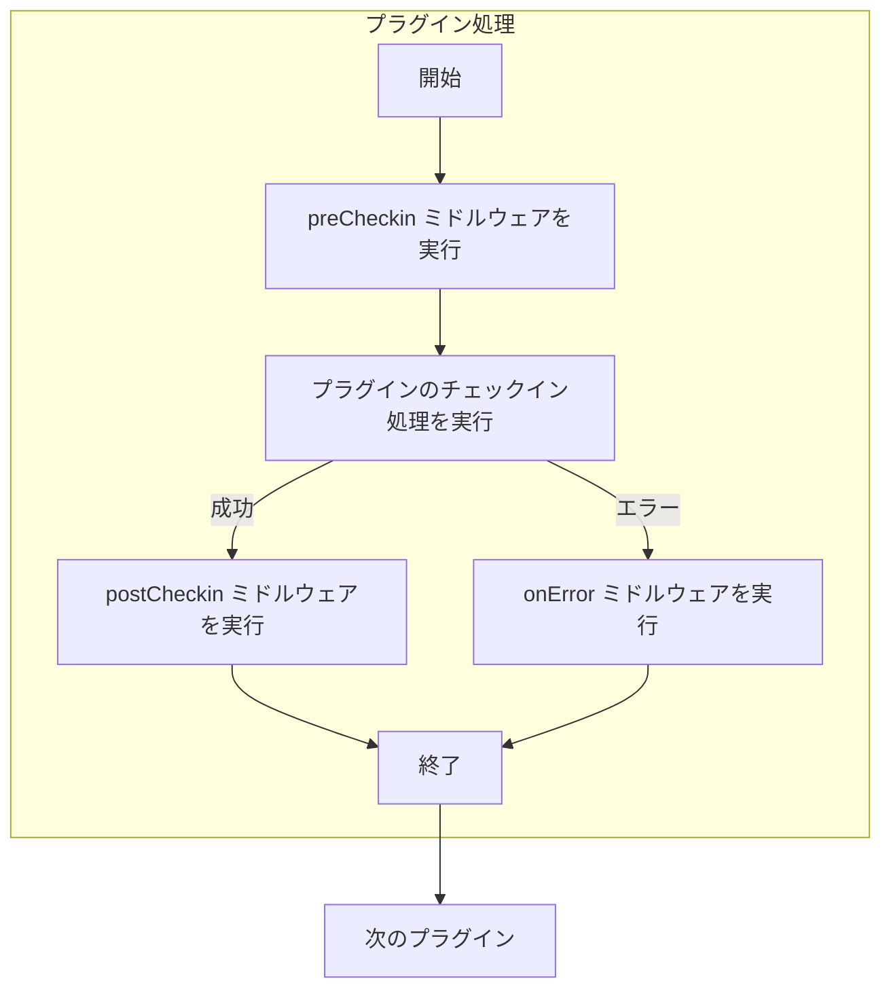

# **プラグイン & ミドルウェア開発ガイド**

## **システム実行フロー**



------

## **実行サイクル**



------

## **コアコンポーネント開発**

### **プラグイン**

#### **テンプレート構造**

```typescript
export const meta = {
  name: "プラグイン名",
  version: "0.1",
  author: "開発者名",
  date: "2025-01-01",
  contact: "開発者連絡先",
  description: "プラグインの機能概要",
  support: "Global;CN"
};

export const checkin = async (config) => {
  // チェックイン処理を記述
};
```

------

#### **例**

プラグインの設定

```typescript
plugins: [
  {
    name: "plugin example",
    modulePath: "./plugin.js",
    options: {
      users: [
        {
          cookies: "This is my cookies",
        },
      ],
      lang: "ja-jp",
    },
  },
],
```

プラグインの実装

```typescript
// ./plugin.js
export const checkin = async (config) => {
    console.log(config)
    return config.users[0].cookies;
};
```

出力例：

```json
{
  "users": [{"cookies": "This is my cookies"}],
  "lang": "ja-jp"
}
```

------

### **ミドルウェアの実装**

#### **テンプレート構造**

```javascript
function preCheckin(options, ctx) {
  // preCheckin処理
}

function postCheckin(options, ctx) {
  // postCheckin処理
}

function onError(options, ctx) {
  // Error処理
}

export default {
  preCheckin,
  postCheckin,
  onError
}
```

------

#### **コンテキストオブジェクト**

```typescript
// 基本的なコンテキスト構造
export interface context {
    plugins_meta: { [name: string]: Record<string, string> }, // プラグインのメタデータ
    timestamp: number; // チェックインプロセスの開始時間
}

// preCheckinのコンテキスト
export interface preContext extends context {
    plugin_options: any; // プラグインのオプション
}

// postCheckinのコンテキスト
export interface postContext extends context {
    result: any; // チェックインの結果
}

// onErrorのコンテキスト
export interface errorContext extends context {
    error: any; // チェックインエラー情報
}
```

------

#### **実装例**

設定例：

```typescript
plugins: [
  {
    name: "plugin example",
    modulePath: "./plugin.js",
    options: {
      users: [
        {
          cookies: "This is my cookies",
        },
      ],
      lang: "ja-jp",
    },
  },
],
middlewares: [
  {
    name: "middleware example",
    modulePath: "@official/middleware.js",
    target: ["plugin example"],
    options: {
      webhook: "http://www.example.com/webhook",
    },
  },
];
```

ミドルウェアの実装

```typescript
// @official/middleware.js
function preCheckin(options, ctx) {
    console.log('options', options);
    console.log('pre ctx', ctx, '\n');
    ctx.plugin_options.users[0].cookies = "Cookie modified by preCheckin"
}

function postCheckin(options, ctx) {
    console.log('\noptions', options);
    console.log('post ctx', ctx);
}

export default {
    preCheckin,
    postCheckin,
}
```

出力例：

```bash
options { webhook: 'http://www.example.com/webhook' }
pre ctx {
  plugins_meta: {
  name: "name",
  version: "0.1",
  author: "developer-name",
  date: "2025-01-01",
  contact: "developer-contact",
  description: "Plugin functionality summary",
  support: "Global/CN"
},
  timestamp: 1717027200000,
  plugin_options: {
    users: [ { cookies: "This is my cookies" } ],
    lang: 'ja-jp'
  }
}

{
  users: [
    { cookies: "Cookie modified by preCheckin" }
  ],
  lang: 'ja-jp'
}

options { webhook: 'http://www.example.com/webhook' }
post ctx {
  plugins_meta: {
  name: "name",
  version: "0.1",
  author: "developer-name",
  date: "2025-01-01",
  contact: "developer-contact",
  description: "Plugin functionality summary",
  support: "Global/CN"
},
  timestamp: 1717027200000,
  result: 'Cookie modified by preCheckin'
}
```

[ミドルウェアデモはこちら](https://github.com/mastersamasama/Mihoyo-AutoSign-Hub/blob/main/api/middlewares/discord-notify.js)

------

## **プラグインを公開する**

### **公式プラグインリストに追加**

1. **開発基準を満たしていることを確認**
   - コード品質とセキュリティ要件を満たしていることを確認してください。
2. **ドキュメントを準備**
   - プラグインの使用方法や設定方法を明記すること。
3. **Pull Requestを送信**
   - 以下のドキュメントを更新：
     - **/doc/plugin_list.md**（プラグインのエントリーを追加）
     - **/doc/plugin/yourplugin.md**（必要に応じて新規作成）
   - テストレポートを含める（推奨）
   - スクリーンショットを追加（任意）

------

## **プラグインの提出要件**

| 項目             | 基準             | 例                       |
| ---------------- | ---------------- | ------------------------ |
| コード品質       | ESLint検証をパス | `eslint-config-standard` |
| テストカバレッジ | 80%以上          | Jestテストレポート       |
| 依存関係管理     | 高リスク依存なし | npm auditをパス          |

------

## **開発基準**

### **メタデータ仕様**

```typescript
export const meta = {
  name: "plugin-name",
  version: "1.0.0",
  author: "github-username",
  date: "2023-03-15",
  contact: "contact@domain",
  description: "プラグインの機能概要",
  support: "Global;CN"
};
```