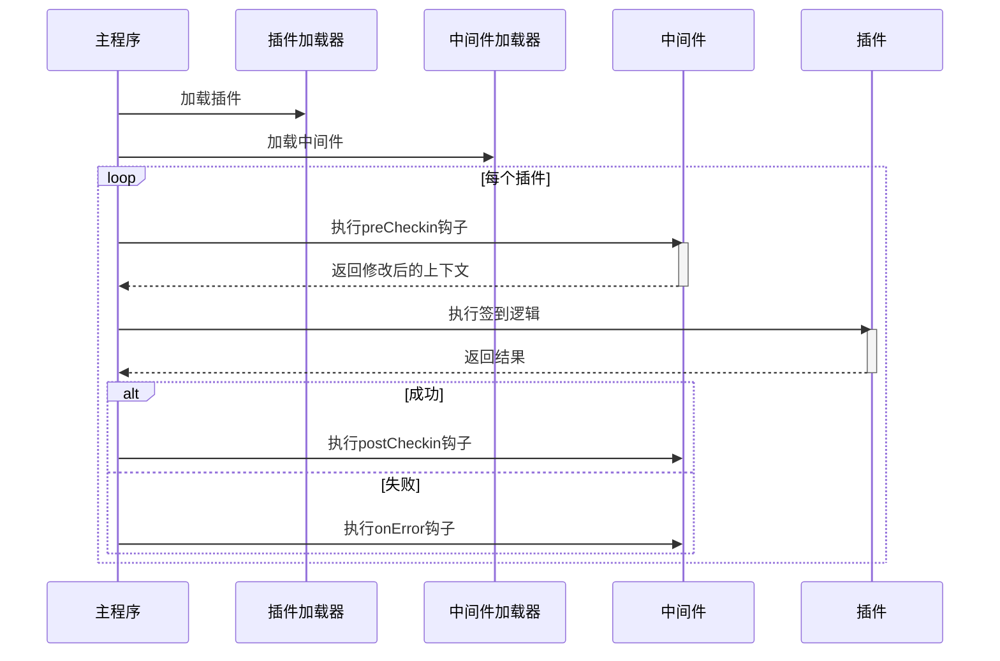
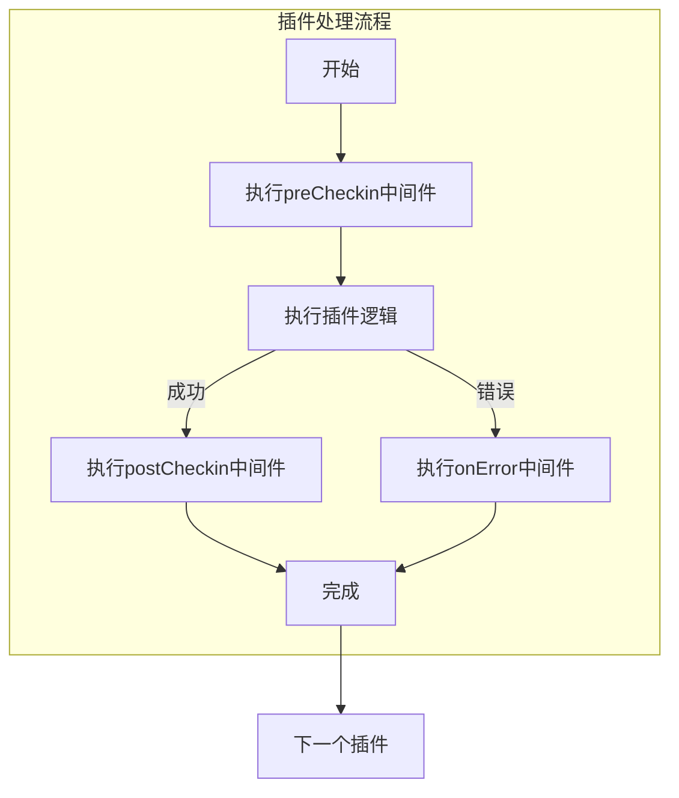

# 插件与中间件开发指南

## 系统执行流程



### 单插件执行周期


---


## 核心组件开发


### 插件开发规范

#### 模板结构
```typescript
export const meta = {
  name: "name",
  version: "0.1",
  author: "developer-name",
  date: "2025-01-01",
  contact: "developer-contact",
  description: "Plugin functionality summary",
  support: "Global/CN"
};

export const checkin = async (config) => {
};
```


### 插件实现示例

#### 插件配置
```typescript
plugins: [
  {
    name: "plugin example",
    modulePath: "./plugin.js",
    options: {
      users: [
        {
          cookies: "This is my cookies",
        },
      ],
      lang: "zh-cn",
    },
  },
],
```

#### 插件实现
```typescript
// ./plugin.js
export const checkin = async (config) => {
	console.log(config)
    return config.users[0].cookies;
};
```

#### 示例输出
```json
{
  "users": [{"cookies": "This is my cookies"}],
  "lang": "zh-cn"
}
```

---

### 中间件开发规范

#### 模板结构
```javascript
function preCheckin(options, ctx) {
  // 预处理逻辑
}

function postCheckin(options, ctx) {
  // 后处理逻辑
}

function onError(options, ctx) {
  // 错误处理
}

export default {
  preCheckin,
  postCheckin,
  onError
}
```

#### 上下文对象定义
```typescript
// 基础上下文结构
export interface context {
    plugins_meta: { [name: string]: Record<string, string> },
    timestamp: number;
}

// 扩展上下文
export interface PreContext extends Context {
  plugin_options: any;
}

export interface PostContext extends Context {
  result: any;
}

export interface ErrorContext extends Context {
  error: any;
}
```

---

## 完整示例

#### 中间件配置

```typescript
plugins: [
  {
    name: "plugin example",
    modulePath: "./plugin.js",
    options: {
      users: [
        {
          cookies: "This is my cookies",
        },
      ],
      lang: "zh-cn",
    },
  },
],
middlewares: [
  {
    name: "middleware example",
    modulePath: "@official/middleware.js",
    target: ["plugin example"],
    options: {
      webhook: "http://www.example.com/webhook",
    },
  },
];
```


#### 中间件实现

```typescript
// @official/middleware.js
function preCheckin(options, ctx) {
    console.log('options', options);
    console.log('pre ctx', ctx, '\n');
    ctx.plugin_options.users[0].cookies = "Cookie modified by preCheckin"
}

function postCheckin(options, ctx) {
    console.log('\noptions', options);
    console,log('post ctx', ctx);
}

export default {
    preCheckin,
    postCheckin,
}
```

#### 执行输出

```bash
# 预处理中间件
options { webhook: 'http://www.example.com/webhook' }
pre ctx {
  plugins_meta: {
  name: "name",
  version: "0.1",
  author: "developer-name",
  date: "2025-01-01",
  contact: "developer-contact",
  description: "Plugin functionality summary",
  support: "Global/CN"
},
  timestamp: 1717027200000,
  plugin_options: {
    users: [ { cookies: 'This is my cookies' } ],
    lang: 'zh-cn'
  }
}

# 插件
{
  users: [
    { cookies: 'Cookie modified by preCheckin' }
  ],
  lang: 'ch-cn'
}

# 后处理中间件
options { webhook: 'http://www.example.com/webhook' }
post ctx {
  plugins_meta: {
  name: "name",
  version: "0.1",
  author: "developer-name",
  date: "2025-01-01",
  contact: "developer-contact",
  description: "Plugin functionality summary",
  support: "Global/CN"
},
  timestamp: 1717027200000,
  result: 'Cookie modified by preCheckin'
}
```

请参阅 [中间件实现示例](https://github.com/mastersamasama/Mihoyo-AutoSign-Hub/blob/main/api/middlewares/discord-notify.js)


## 贡献您的插件

### 发布插件到官方列表
请按照以下步骤将您开发的插件加入[官方插件列表](plugin_list.md)：

1. **确保符合开发规范**
   
2. **文档准备**

3. **提交Pull Request**
   - 更新文档(**/doc/plugin_list.md**, /doc/plugin/yourplugin.md)
   - 包含测试报告（可选）
   - 添加演示截图（可选）

### 插件提交要求
| 项目       | 要求标准       | 示例                     |
| ---------- | -------------- | ------------------------ |
| 代码规范   | 通过ESLint检测 | `eslint-config-standard` |
| 测试覆盖率 | ≥80%           | Jest测试报告             |
| 依赖管理   | 无高危依赖项   | npm audit通过            |

---

## 开发规范

### 元数据标准
```typescript
export const meta = {
  name: "插件英文名",          // 全小写字母+连字符
  version: "1.0.0",          // 语义化版本
  author: "Github用户名",      // 如: mastersamasama
  date: "2023-03-15",        // 最后更新日期
  contact: "contact@domain", // 联系方式
  description: "Plugin description",
  support: "CN;Global"  // 支持地区
};
```

请通过GitHub Issue提交审核申请
